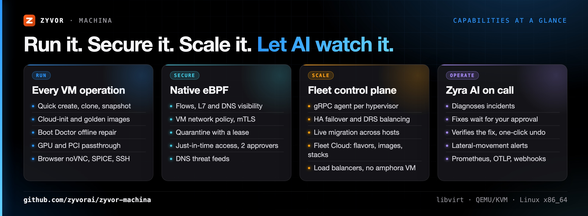
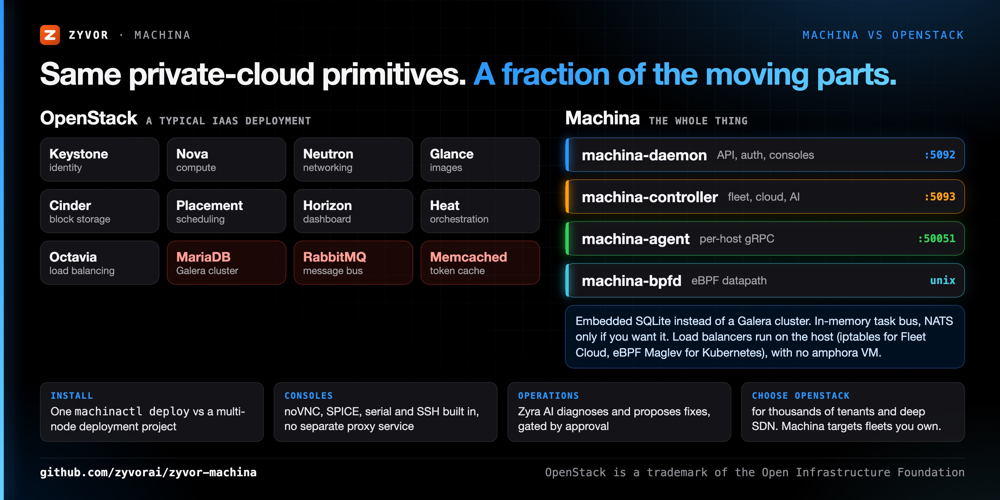
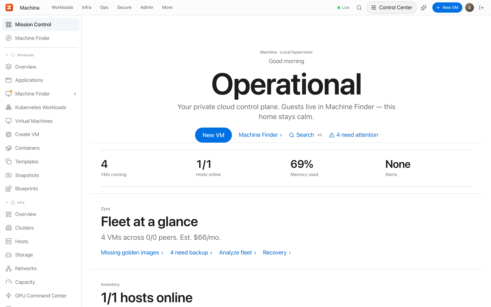
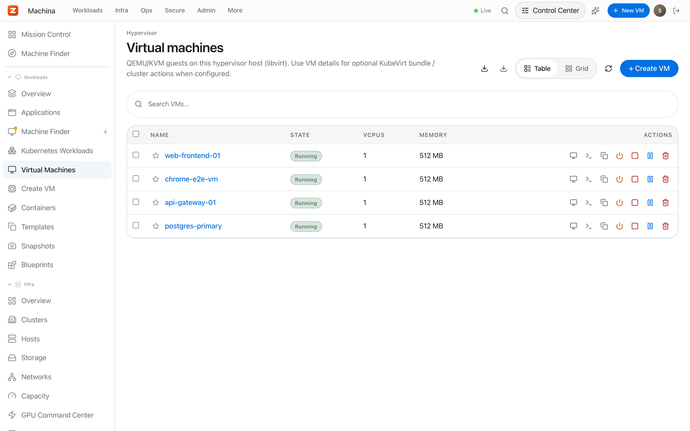
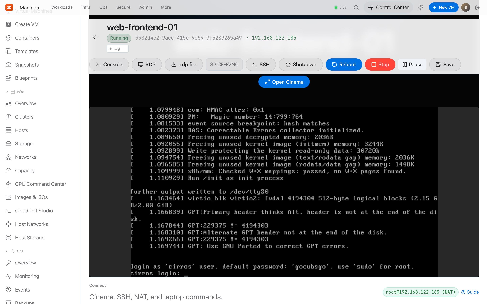
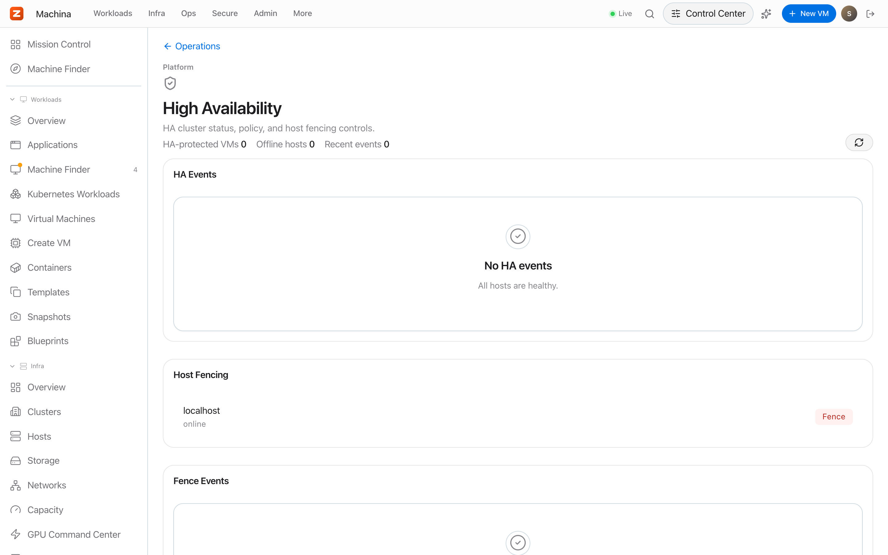
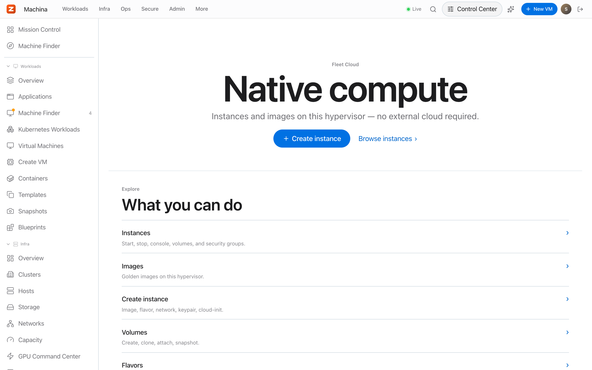
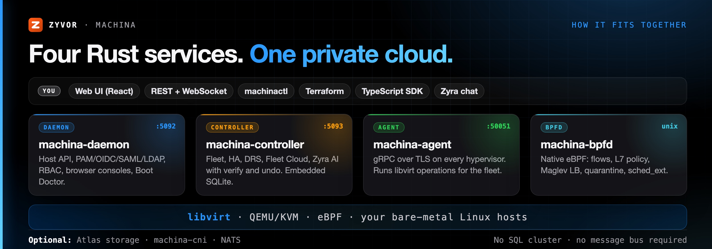

<div align="center">

# Machina

[](https://github.com/zyvorai/machina/actions/workflows/ci.yml)
[](LICENSE)
[](Cargo.toml)
[](docs/README.md)
[](https://zyvorai.github.io/machina/)

[](https://zyvor.dev/schedule?utm_source=github&utm_medium=machina&utm_campaign=readme_hero)
[](https://zyvor.dev/poc?utm_source=github&utm_medium=machina&utm_campaign=readme_hero)
[](#quickstart)


### Your metal. Your cloud. One control plane.

**The private cloud you can install before lunch.** VMs, browser consoles, fleet HA/DRS, an OpenStack-style self-service cloud, a native eBPF datapath and AI operations, from a handful of Rust services on plain Linux + KVM.

**One-command install** · **No SQL cluster, no message queue** · **Consoles built in** · **eBPF networking built in** · **AI that asks before it acts**

</div>

---

## Why Machina

| When this happens… | Machina gives you… |
|---|---|
| You want a private cloud, but OpenStack is a six-week project and a full-time team | `./machinactl deploy`: a few Rust services, embedded SQLite, a browser UI on `:5092` minutes later |
| VMware renewal quotes keep climbing | Open KVM/libvirt underneath, with HA failover, DRS and live migration on top |
| libvirt ops live in a pile of `virsh` scripts | One dashboard, a REST API with 900+ routes, a CLI and a Terraform provider over the same model |
| Every console needs its own gateway | noVNC, SPICE, serial and SSH proxied by the daemon, with RBAC and audit |
| Networking means Cilium + Tetragon + kube-proxy + a firewall agent | One eBPF service, `machina-bpfd`: service load balancing, Kubernetes CNI, DDoS shield, VM isolation and flow visibility |
| On-call means triaging the same incidents at 3 a.m. | Zyra AI diagnoses, correlates and proposes the fix, then waits for a human approval |



---

## Machina vs OpenStack



| | **Machina** | **OpenStack** (typical IaaS) |
|---|---|---|
| Services to run | **4** Rust services (daemon, controller, agent, `machina-bpfd`) | 9+ services (Keystone, Nova, Neutron, Glance, Cinder, Placement, Horizon, Heat, Octavia) |
| Backing infrastructure | Embedded SQLite; optional NATS | MariaDB/Galera, RabbitMQ, Memcached |
| Install | `./machinactl deploy` on one host, `deploy-remote.sh` for the next | Kolla-Ansible / OpenStack-Ansible deployment project |
| Smallest useful footprint | A single KVM host | A multi-node control plane |
| Flavors, images, volumes, security groups, stacks, load balancers | Yes, in [Fleet Cloud](docs/customer/pages/fleet-cloud/fleet-cloud.md) | Yes (Nova, Glance, Cinder, Neutron, Heat, Octavia) |
| Load balancer data plane | Maglev eBPF service LB (Kubernetes, QUIC at XDP) + iptables member rules for Fleet Cloud LBs; no amphora VM | Amphora VMs (Octavia) |
| Network datapath and security | Native eBPF (XDP, TC, cgroup, BPF-LSM), lease-gated enforcement | Neutron agents + OVS/OVN, security groups via iptables/OVS |
| Browser consoles | noVNC, SPICE, serial, SSH built into the daemon | noVNC/SPICE proxy services |
| HA failover and DRS | Built into the controller ([controller HA](docs/controller-ha.md)) | Separate projects: Masakari (instance HA), Watcher (rebalancing) |
| AI operations | Zyra AI: diagnostics, incidents, rightsizing, approvals | Not included |
| Containers and Kubernetes | Podman containers and pods, KubeVirt inventory and migration | Zun / Magnum (separate projects) |
| **Choose OpenStack when** | | You run thousands of tenants, need Neutron-grade SDN breadth, or depend on its ecosystem |

Machina targets the fleets you own: a lab, a branch, a sovereign region, a VMware exit. It deliberately trades OpenStack's hyperscale multi-tenancy for a cloud one person can install, understand and upgrade.

---

## See it live

Captured from a real deployment on Ubuntu 26.04, not mockups.



### Every VM operation, in one place

Create, clone, snapshot, back up and migrate. Cloud-init, GPU and PCI passthrough, golden images built with Packer (Linux, plus Windows 10/11 through dockur when enabled), networks, storage pools and nwfilters. [VM guide →](docs/customer/pages/core/vms.md)



### Consoles in the browser, no gateway to deploy

noVNC, SPICE, serial and SSH are proxied by `machina-daemon` itself, behind the same RBAC and audit log as everything else. VM detail leads with a live console preview. [Console architecture →](docs/consolehub-architecture.md)



### A fleet, not a host

Add hypervisors with a gRPC agent over TLS. The controller keeps desired state, fails VMs over when a host dies, balances load with DRS and live-migrates between hosts. [Controller HA and DRS →](docs/controller-ha.md)



### Fleet Cloud: self-service like a public cloud

Flavors, images, instances, volumes and snapshots, security groups, keypairs, floating IPs, server groups, Heat-style stacks, projects and load balancers, all native controller APIs. [Fleet Cloud →](docs/customer/pages/fleet-cloud/fleet-cloud.md)



### Zyra AI: an operator that asks first

Autonomous diagnostics across the fleet, incident correlation, rightsizing and natural-language operations, with bring-your-own LLM providers (keys encrypted at rest) and an approval queue in front of every change. [Zyra AI →](docs/customer/pages/platform-security/platform-zyra.md)


### Networking and security, in the kernel

Machina ships its own eBPF datapath instead of bolting on Cilium, Tetragon or a separate firewall agent. One root service, `machina-bpfd`, provides:

- **Load balancing**: Maglev service LB for Kubernetes (socket-level, NodePort at TC or XDP, DSR) and QUIC-LB at XDP.
- **Kubernetes CNI** (opt-in): `machina-cni` can replace flannel, kube-proxy and Cilium, with NetworkPolicy and optional Cilium policy migration. Bootstrapped k3s clusters keep their default CNI unless you choose it, and the agent refuses to take over a node that already has one.
- **Protection**: XDP DDoS shield, emergency node isolation, VM edge isolation and rate limits, a QEMU sandbox and a BPF-LSM guard around the VMM.
- **Visibility**: flows, DNS, L7 (HTTP, TLS SNI, gRPC, Redis, PostgreSQL, MySQL, Kafka), JA3/JA4 fingerprints, network-change audit and per-VM runtime histograms.
- **Inside guests**: per-container network and LSM policy through GuestKit, from the VM's **Guest policy** tab.

Everything that can drop traffic starts in observe mode and enforces only under a time-boxed lease that the kernel honours on its own; nothing is persisted. [Native eBPF →](docs/ebpf/README.md)

### And the rest of the platform

- **Identity and access**: PAM, OIDC, SAML and [LDAP](docs/ldap-auth.md) sign-in, role-based access, a full audit trail. [Admin guide →](docs/handbook/admin-configuration.md)
- **Containers**: local Podman/Docker containers and Podman pods next to your VMs. [Containers →](docs/customer/pages/infrastructure/containers.md)
- **Kubernetes**: KubeVirt inventory and a documented migration path. [KubeVirt →](docs/kubevirt-migration.md)
- **Observability**: Prometheus metrics, OTLP export, PSI/cgroup pressure, alerts and webhooks. [Observability →](docs/guides/observability.md)
- **Storage**: Atlas integration puts VM disks on Ceph RBD, NFS or ZFS volumes with snapshot, backup and restore. [Atlas →](docs/atlas-storage.md)
- **Automation**: [Terraform provider](terraform/machina/README.md), [TypeScript SDK](sdk/typescript/README.md), OpenAPI spec, `machinactl`.

---

## How it fits together



| Component | Port | Role |
|---|---|---|
| `machina-daemon` | `:5092` | Single-host REST + WebSocket API, PAM/OIDC/SAML/LDAP, RBAC, console proxies, serves the web UI |
| `machina-controller` | `:5093` | Multi-host control plane: fleet, HA, DRS, Fleet Cloud, Zyra AI. Embedded SQLite, optional NATS |
| `machina-agent` | `:50051`, `:50052` | Per-hypervisor gRPC agent (TLS) that executes libvirt and eBPF operations for the controller; `:50052` is its console proxy |
| `machina-bpfd` | `/run/machina-bpf/bpfd.sock` | Root eBPF service: datapath, telemetry and enforcement, exposed through the daemon at `/api/v1/bpf/*` |
| `machina-cni` | — | Kubernetes CNI plugin + node agent (`contrib/machina-cni.service`), drives bpfd's service and policy maps |
| `machina-scx` | — | Optional sched_ext VM scheduler, supervised by bpfd (kernel 6.12+) |

The daemon alone is a complete single-host manager. Add the controller and an agent per host for a fleet; `machina-bpfd` runs on every host that should get the eBPF datapath.

---

## Quickstart

On any Linux host with KVM (Ubuntu, Debian, Fedora, RHEL/Alma/Rocky, openSUSE, Arch):

```bash
git clone https://github.com/zyvorai/machina.git && cd machina
./machinactl deploy        # deps · build · install · start · verify
# open https://<host>:5092 and sign in with a local (PAM) account
```

From your laptop to a remote host (sources are rsync'd and built on the server; nothing compiles locally):

```bash
./scripts/deploy-remote.sh user@host                  # build + install daemon and web UI on the server
./scripts/deploy-remote.sh user@host --platform       # plus controller and agent
./scripts/deploy-remote.sh user@host --remote-build   # compile only, no install (fast build check)
```

### Requirements

- 64-bit Linux (x86_64 or aarch64) with VT-x/AMD-V, so `/dev/kvm` exists, and libvirt.
- Ubuntu, Debian, Fedora, RHEL/Alma/Rocky, openSUSE or Arch.
- Native eBPF: kernel with BTF and cgroup v2; 6.6+ for TCX attach, BPF-LSM (`lsm=...,bpf`) for VMM guard enforcement, 6.12+ for the sched_ext scheduler. `GET /api/v1/bpf/status` shows what your kernel supports.
- Ports: `5092` (daemon, web UI), `5093` (controller), `50051`/`50052` (agent). [Full port list →](docs/handbook/README.md#ports)
- Any current browser; consoles need no plugins.

| Next step | Where |
|---|---|
| First login and workflows | [Getting started](docs/customer/getting-started.md) |
| Every screen, explained | [Page-by-page guides](docs/customer/pages/README.md) |
| Ports, auth, TLS, config | [Admin configuration](docs/handbook/admin-configuration.md) |
| Production pilot checklist | [Customer site readiness](docs/CUSTOMER_SITE_READINESS.md) |
| Contributor setup | [Engineering onboarding](docs/ENGINEERING_ONBOARDING.md) |
| Everything else | [Docs index](docs/README.md) · [Website](https://zyvorai.github.io/machina/) |

---

## Maturity

| Area | Status |
|---|---|
| VM lifecycle, storage, networks, consoles, auth/RBAC, audit | Stable |
| Controller fleet, HA with fencing, DRS, live migration | Stable |
| Fleet Cloud (flavors, images, instances, volumes, security groups, stacks, LBs) | Stable |
| Native eBPF observability (flows, DNS, L7, TLS, health, VM runtime) | Preview, observe-only |
| Native eBPF enforcement (policies, shield, node isolation, VM edge, sandbox, VMM guard) | Preview, lease-gated |
| `machina-cni` Kubernetes networking | Preview |
| QUIC-LB, AF_XDP, direct redirect, sched_ext scheduler, guest policy | Opt-in, off by default |
| Zyra AI | Stable; every change goes through human approval |
| Atlas storage integration | Opt-in (`ATLAS_ENABLED=1`) |

---

## Develop

The Rust workspace needs Linux libvirt headers; build on Linux (or use `deploy-remote.sh --remote-build` from a Mac). The web UI builds anywhere.

```bash
make build && make test && make lint       # Rust workspace (Linux)
make bpf-deps                              # eBPF toolchain: nightly + bpf-linker
sudo make bpf-test                         # eBPF netns smoke (veths only)
cd web && npm install && npm run dev       # UI on :3000, proxied to a daemon on :5092
cd web && npm test && npm run build        # vitest + typecheck + bundle
```

Start with [Engineering onboarding](docs/ENGINEERING_ONBOARDING.md); architecture and conventions are in [CLAUDE.md](CLAUDE.md).

---

## Part of the Zyvor stack

| Product | Role |
|---|---|
| **Machina** | Private cloud on KVM: VMs, fleet, Fleet Cloud, native eBPF, Zyra AI |
| **Atlas** | Storage control plane (Ceph/NFS/ZFS) for VM disks, snapshots, backups |
| **GuestKit** | In-guest agent: health, offline VM inspection, migration assurance, per-container eBPF policy |
| **HyperSDK / hyper2kvm** | Multi-cloud VM migration into KVM |

→ [zyvor.dev](https://zyvor.dev)

---

## License

Machina is source-available under the **[Zyvor Production License v1.0](LICENSE)** (SPDX `LicenseRef-Zyvor-Production-1.0`).

- **Free** for evaluation, development, testing, research, education, homelabs and all other non-production use.
- **Production use** requires an annual enterprise subscription. Plans, support levels and terms: [SUBSCRIPTION-MODEL.md](docs/SUBSCRIPTION-MODEL.md) · [licensing model](docs/legal/LICENSING-MODEL.md).

Contributions are welcome under the same license; see [CONTRIBUTING.md](CONTRIBUTING.md). Report vulnerabilities privately per [SECURITY.md](SECURITY.md).

---

<div align="center">

### Ready to run your own cloud?

[](https://zyvor.dev/schedule?utm_source=github&utm_medium=machina&utm_campaign=readme_footer)
[](https://zyvor.dev/poc?utm_source=github&utm_medium=machina&utm_campaign=readme_footer)
[](https://github.com/zyvorai/machina)

</div>
