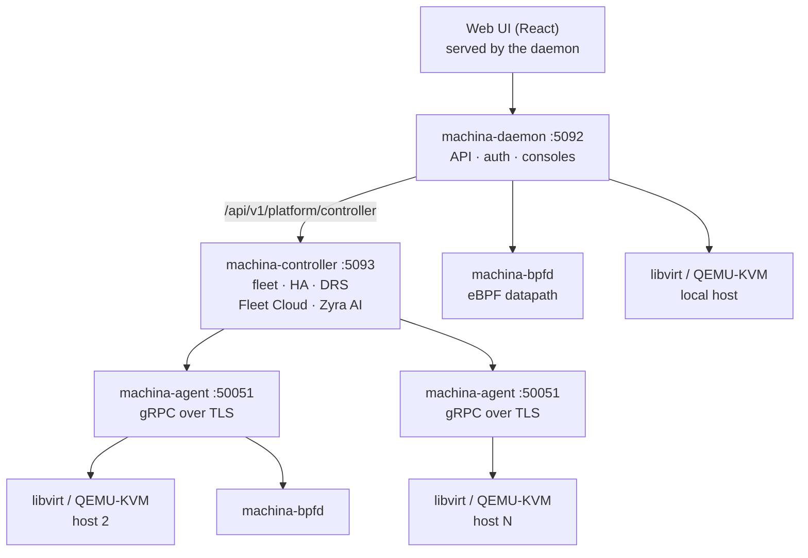

# Architecture

Machina is a handful of Rust services. Start with the daemon on one host, add the controller and an agent per host
when you have more than one, and run `machina-bpfd` wherever you want the native eBPF datapath.

## Components

| Component | Port | Role |
| --- | --- | --- |
| `machina-daemon` | `:5092` | Single-host REST and WebSocket API, sign-in (PAM, OIDC, SAML, LDAP), RBAC, audit, console proxies. Serves the web UI and speaks to libvirt directly. |
| `machina-controller` | `:5093` | Multi-host control plane: fleet inventory, desired-state reconciliation, HA failover, DRS, Fleet Cloud and Zyra AI. State in embedded SQLite; NATS fan-out is optional. |
| `machina-agent` | `:50051` (gRPC), `:50052` (consoles) | Runs on each managed hypervisor. Executes libvirt and eBPF operations for the controller over gRPC with TLS and proxies consoles. |
| `machina-bpfd` | `/run/machina-bpf/bpfd.sock` | Root eBPF service: load balancing, CNI datapath, DDoS shield, isolation, enforcement and telemetry. See [Native eBPF](../networking/ebpf-overview.md). |
| `machina-cni` | — | Opt-in Kubernetes CNI plugin and node agent (clusters keep their default CNI otherwise). |
| `machina-scx` | — | Optional sched_ext VM scheduler, supervised by `machina-bpfd`. |

## Request path

The browser only ever talks to the daemon. Controller calls go to `/api/v1/platform/controller` on the daemon, which
reverse-proxies them to the controller. That gives one origin, one TLS certificate and one session for the whole
platform. eBPF calls go to `/api/v1/bpf/*` on the daemon, which forwards them to `machina-bpfd` over its local
socket; the controller reaches remote hosts' bpfd through each agent.

Long-running controller operations (migrations, rebuilds, image builds) return a task; the UI polls
`/api/v1/tasks/{task_id}` until it completes.

## What is not in the box

There is no message queue, external database, identity service or separate network agent to run. The controller
embeds SQLite, NATS is only needed if you want task fan-out across controller instances, sign-in reuses the host's PAM
stack or your existing OIDC, SAML or LDAP provider, and networking and security come from the built-in eBPF service.

## Crates

| Crate | Role |
| --- | --- |
| `core` | Shared types, libvirt helpers, XML builders, audit, fleet placement |
| `daemon` | The `machina-daemon` binary (Axum/Tokio) |
| `controller` | The `machina-controller` binary |
| `agent` | The `machina-agent` binary (tonic) |
| `bpf/machina-bpf`, `bpf/machina-bpf-ebpf`, `bpf/machina-bpf-common` | `machina-bpfd`, its kernel programs (Aya) and shared map types |
| `bpf/machina-cni`, `bpf/machina-scx` | Kubernetes CNI and the sched_ext scheduler |
| `spec` | Declarative VM and cluster spec types mirroring the gRPC proto |
| `translate` | libvirt domain XML to internal types, QEMU helpers |
| `virt-image-build` | virt-builder and Packer golden-image job runner |
| `vessel-core` | Podman and Docker container engine |
