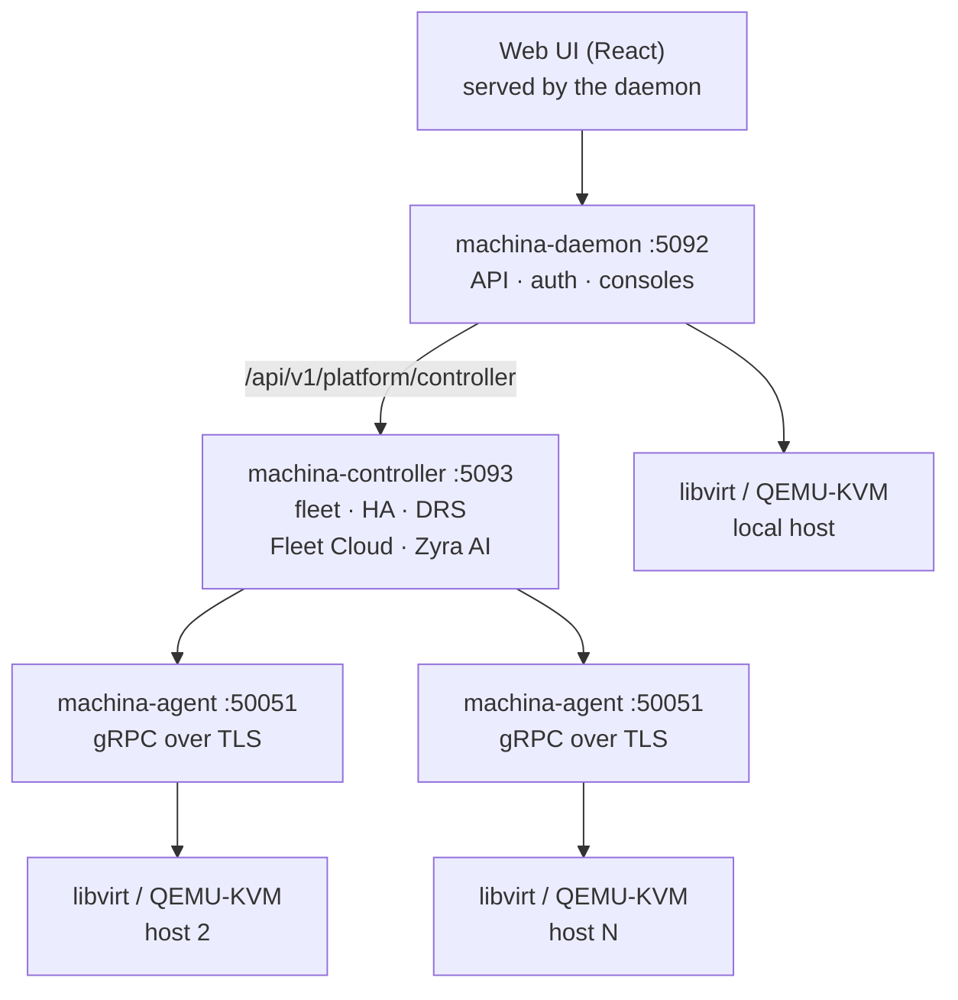

# Architecture

Machina is three Rust binaries. Start with one, add the other two when you have more than one host.

## The three components

| Component | Port | Role |
| --- | --- | --- |
| `machina-daemon` | `:5092` | Single-host REST and WebSocket API, sign-in (PAM, OIDC, SAML, LDAP), RBAC, audit, console proxies. Serves the web UI and speaks to libvirt directly. |
| `machina-controller` | `:5093` | Multi-host control plane: fleet inventory, desired-state reconciliation, HA failover, DRS, Fleet Cloud and Zyra AI. State in embedded SQLite; NATS fan-out is optional. |
| `machina-agent` | `:50051` | Runs on each managed hypervisor. Executes libvirt operations for the controller over gRPC with TLS and proxies consoles. |

## Request path

The browser only ever talks to the daemon. Controller calls go to `/api/v1/platform/controller` on the daemon, which
reverse-proxies them to the controller. That gives one origin, one TLS certificate and one session for the whole
platform.

Long-running controller operations (migrations, rebuilds, image builds) return a task; the UI polls
`/api/v1/tasks/{task_id}` until it completes.

## What is not in the box

There is no message queue, external database or identity service to run. The controller embeds SQLite, NATS is only
needed if you want task fan-out across controller instances, and sign-in reuses the host's PAM stack or your existing
OIDC, SAML or LDAP provider.

## Crates

| Crate | Role |
| --- | --- |
| `core` | Shared types, libvirt helpers, XML builders, audit, fleet placement |
| `daemon` | The `machina-daemon` binary (Axum/Tokio) |
| `controller` | The `machina-controller` binary |
| `agent` | The `machina-agent` binary (tonic) |
| `spec` | Declarative VM and cluster spec types mirroring the gRPC proto |
| `translate` | libvirt domain XML to internal types, QEMU helpers |
| `virt-image-build` | virt-builder and Packer golden-image job runner |
| `vessel-core` | Podman and Docker container engine |
