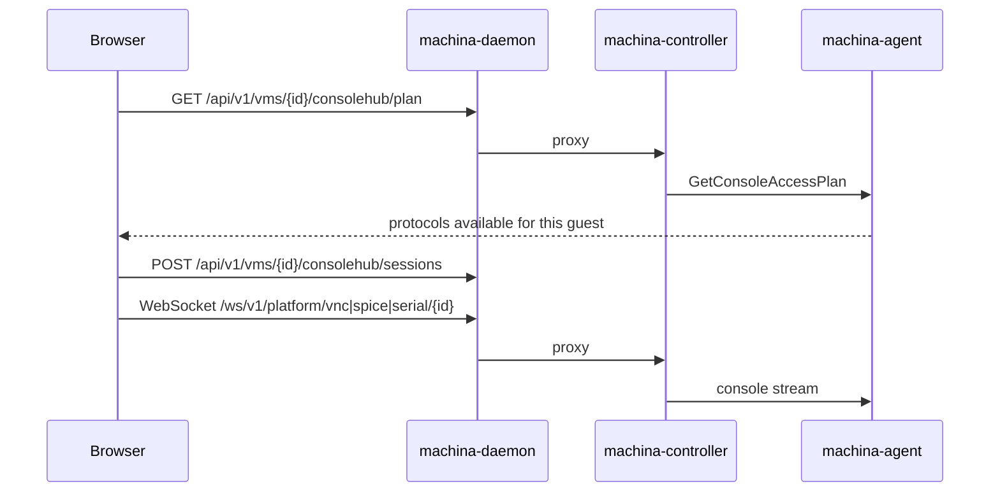

# Consoles

noVNC, SPICE, serial and SSH are served by `machina-daemon` (single host) or proxied through
`machina-controller` and `machina-agent` (fleet). There is no separate console gateway to install, and every session
goes through the same RBAC and audit log as the rest of the API.

## Protocol selection

| Guest | Default console |
| --- | --- |
| Linux with VNC graphics | noVNC |
| Headless Linux | SSH (in-browser terminal) |
| SPICE graphics | SPICE |
| Recovery / boot issues | Serial |
| Windows with Remote Desktop enabled | Native RDP through a hypervisor NAT port-forward, with a downloadable `.rdp` file |

RDP only appears once the agent confirms the guest is listening on port 3389.

## VM detail

The VM detail page leads with a live console preview, so the first thing an operator sees is the machine itself.

