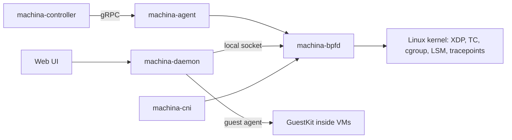

# Native eBPF overview

Machina ships its own eBPF datapath, written in Rust with [Aya](https://aya-rs.dev).
A single root service, **`machina-bpfd`**, loads the kernel programs and serves the
daemon, the controller and the UI. You do not install Cilium, Tetragon, kube-proxy
or a separate network-security agent: Machina replaces them.

## What it does

| Area | Features |
|---|---|
| Load balancing | Maglev service LB for Kubernetes, QUIC-LB at XDP |
| Kubernetes | `machina-cni`: pod networking, NetworkPolicy, optional Cilium policy CRDs |
| Host protection | XDP DDoS shield, emergency node isolation |
| VM protection | VM edge isolation and rate limits, QEMU sandbox, VMM guard (BPF-LSM) |
| Visibility | Flows, DNS, L7 (HTTP, TLS SNI, gRPC, Redis, PostgreSQL, MySQL, Kafka), TLS JA3/JA4, network change audit, VM runtime histograms |
| Performance | AF_XDP, direct tap redirect, sched_ext VM scheduler |
| Guests | Per-container network and LSM policy inside VMs via GuestKit |

Everything is on **Platform → Security → Native eBPF** (22 tabs) and under
`/api/v1/bpf/*` on each host. The controller rolls it up fleet-wide.

## Safe by default

- Features that can drop traffic start in **observe** or **audit** mode.
- **Enforcement needs a lease** (15 minutes by default). The deadline is checked
  in the kernel datapath, so drops stop on time even if a service stalls.
- **Nothing is persisted.** A restart comes back in observe mode.
- Dangerous targets are guarded: default-deny never attaches to a host uplink,
  node isolation refuses to arm without SSH allowed, and AF_XDP refuses the
  default-route interface.

## Kernel requirements

`GET /api/v1/bpf/status` reports what your kernel supports, and the Native eBPF
overview shows it as pills.

| Feature flag | Needed for |
|---|---|
| `btf` | Most programs (`/sys/kernel/btf/vmlinux`) |
| `tcx` | VM edge and node isolation (kernel 6.6+) |
| `cgroup2` | Socket LB, sandbox, TLS and L7 sampling |
| `lsm_bpf` | VMM guard enforce (`bpf` in the active LSM list) |
| `sched_ext` | VM scheduler (kernel 6.12+) |
| `xsk` | AF_XDP |

Any recent distribution kernel (6.6 or later) runs the core datapath. See the
[engineering reference](https://github.com/zyvorai/zyvor-machina/tree/main/docs/ebpf)
for full details.
